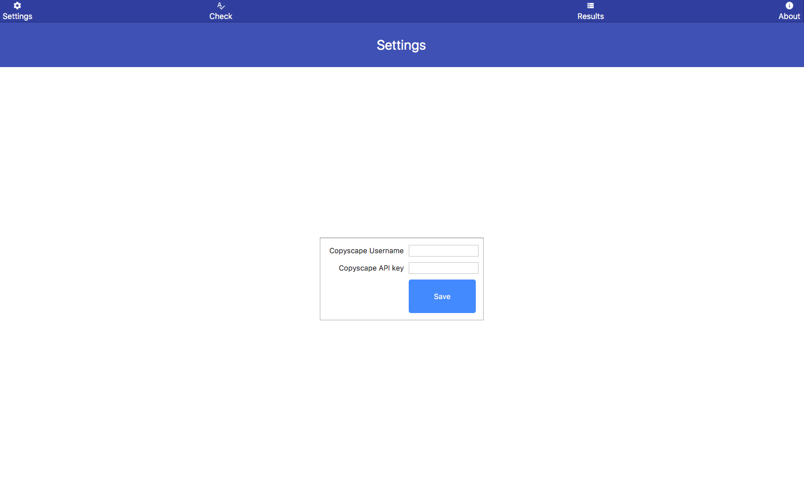
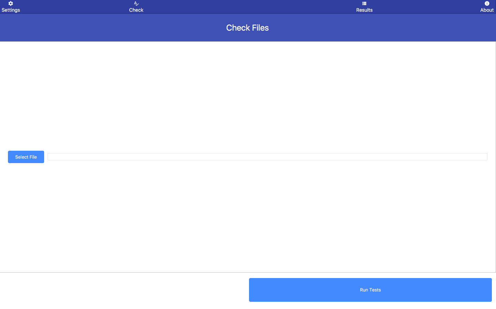
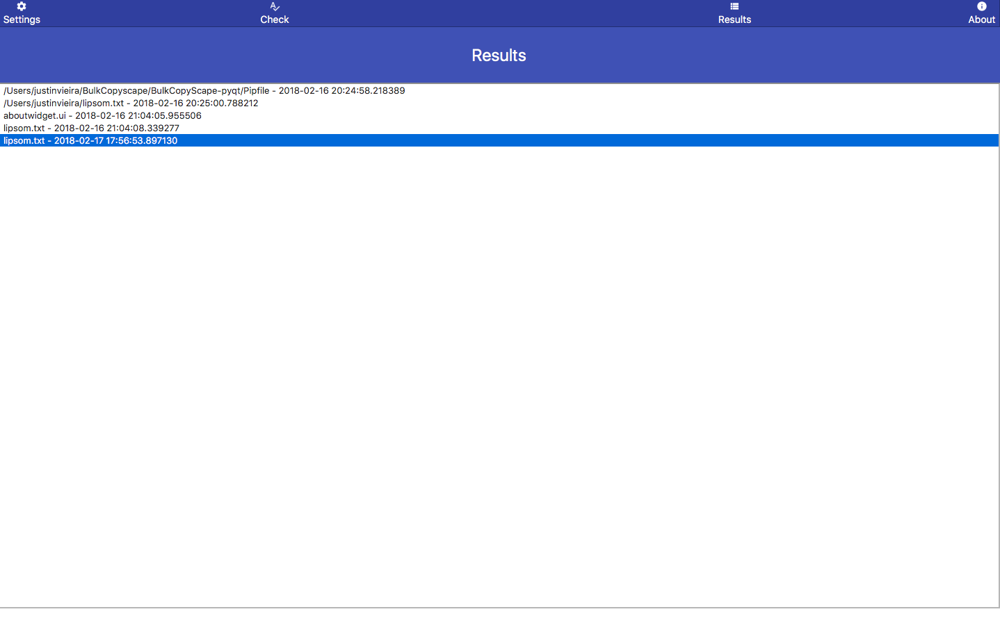
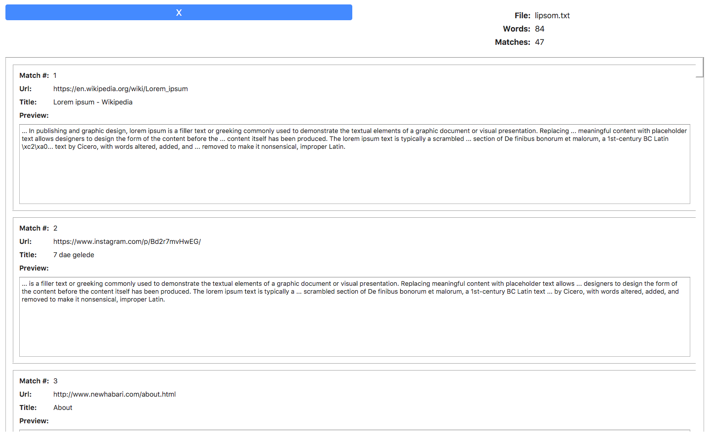

Bulk CopyScape
=============

Bulk Copyscape is a script that utilizes Copyscape's API to by-pass the normal bulk upload queue, allowing you to quickly check websites for plagiarism or duplicate content in a matter of moments - for free!

This tool is great for busy SEO's and webmasters looking to protect their content from thieves or to clear up duplicate information from being found by Google.
Designed by redditor [http://reddit.com/u/angryrancor](/u/angryrancor) of [Rancorsoft](http://rancorsoft.com). Words by [http://reddit.com/u/fearthejew](/u/fearthejew)

Desktop/Mobile App - User Install instructions
=============

Use one of the following:

[MacOS app - md5: 6050ed45a780bfde68d714e32f7e274d](https://github.com/angryrancor/BulkCopyscape/blob/master/BulkCopyScape-pyqt/release/MacOS/BulkCopyScape.zip)

[Windows installer - md5: d16511d3d904d7567a8fa6713c4803ba](https://github.com/angryrancor/BulkCopyscape/blob/master/BulkCopyScape-pyqt/release/Windows/BulkCopyscape_Install.exe)

Desktop/Mobile App - Developer Install instructions
=============

Requires [Python3](https://www.python.org/downloads/) and [Qt](https://www.qt.io/download). The free open source version of Qt is fine.

* Install [Python3](https://www.python.org/downloads/) and [Qt](https://www.qt.io/download) if you don't already have them.
* Download the repository via [git](https://github.com/angryrancor/BulkCopyscape.git) or [zip file](https://github.com/angryrancor/BulkCopyscape/archive/master.zip). If using the zip file, extract it.
* Open a cmd/shell prompt at the BulkCopyScape-pyqt folder.
* Type `pip install -r requirements.txt` to install the libraries used by the app.
* Type `python3 -m bulkcopyscape` to run the app!

Web app - Live Public Beta
=============

Just want to give Bulk Copyscape a try, without installing it yourself?  [Bulk Copy Tools](https://bulkcopytools.com) has what you need.

Web App - Install Instructions
=============

Requires [PHP](http://php.net) and [Curl](http://curl.haxx.se)

Windows Users:

* Give [the installer](https://github.com/angryrancor/BulkCopyscape/blob/master/BulkCopyScape-Web/windows-installer/Installer/InstallBulkCopyscape.exe) a try.  MD5 (InstallBulkCopyscape.exe) = 3eca09855a18ff676a4c968b4a519e20
* Set {install dir}/uploads writeable by your webserver (or alternatively everyone)
* Make sure Curl is in your system PATH.

Other Platforms:

* Copy all files to a folder which can execute PHP.  
* Inside this folder, make a "./uploads" folder.
* Make sure you can upload to the uploads folder (e.g. run "chmod 0644 ./uploads" or similar permissions escalation).
* Browse to SetupForm.php on your web host or local webserver url.
* note - if there are problems with hard coded paths or configs, please email justin [at] rancorsoft.com or /u/angryrancor on reddit
